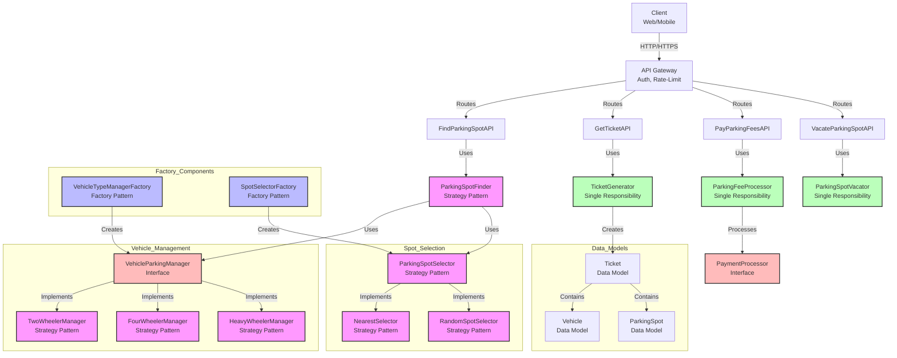

# Parking Lot System

## Overview
This is a parking lot management system that handles different types of vehicles, parking spots, and payment processing. The system is designed with extensibility and maintainability in mind, following SOLID principles and various design patterns.

## System Architecture

*Color coding indicates different design patterns:*
- *Pink: Strategy Pattern components*
- *Blue: Factory Pattern components*
- *Green: Single Responsibility Principle components*
- *Red: Interface components*

## Design Patterns Used

### 1. Strategy Pattern (Pink)
- Used in parking spot selection strategy
- Implemented through `ParkingSpotSelector` interface with concrete implementations:
  - `NearestSelector`: Selects the nearest available parking spot
  - `RandomSpotSelector`: Selects a random available parking spot
- Also used in vehicle management through different vehicle type managers
- Allows dynamic switching between different strategies

### 2. Factory Pattern (Blue)
- `VehicleTypeManagerFactory`: Creates appropriate vehicle parking managers based on vehicle type
- `SpotSelectorFactory`: Creates appropriate spot selectors based on selection strategy
- Encapsulates object creation logic and provides a clean interface for client code

### 3. Interface Segregation (Red)
- `VehicleParkingManager` interface defines specific methods for parking management
- `PaymentProcessor` interface for payment processing
- Separate interfaces for different responsibilities

### 4. Single Responsibility Principle (Green)
- Each class has a single responsibility:
  - `TicketGenerator`: Handles ticket generation
  - `ParkingFeeProcessor`: Handles fee calculation and processing
  - `ParkingSpotVacator`: Handles spot vacating logic

## Key Components

### Data Models
- `Vehicle`: Represents a vehicle with type and details
- `ParkingSpot`: Represents a parking spot with location and availability
- `Ticket`: Represents a parking ticket with vehicle and spot information

### Managers
- `VehicleParkingManager`: Interface for vehicle-specific parking management
- Concrete implementations for different vehicle types:
  - `TwoWheelerManager`
  - `FourWheelerManager`
  - `HeavyWheelerManager`

### APIs
- `FindParkingSpotAPI`: Handles parking spot finding
- `GetTicketAPI`: Handles ticket generation
- `PayParkingFeesAPI`: Handles payment processing
- `VacateParkingSpotAPI`: Handles spot vacating

### Payment Processing
- Supports multiple payment modes (Cash/Card)
- Flexible payment processing through `PaymentProcessor` interface

## Features
1. Support for multiple vehicle types
2. Different parking spot selection strategies
3. Flexible payment processing
4. Ticket-based parking management
5. Floor-based parking organization
6. Entry/exit point management

## Usage
The system provides APIs for:
1. Finding available parking spots
2. Generating parking tickets
3. Processing parking fees
4. Vacating parking spots

Each API is designed to be extensible and maintainable, following SOLID principles and design patterns. 