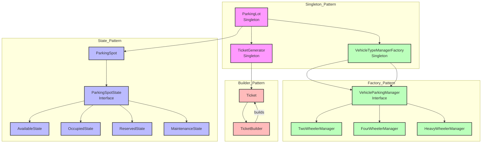
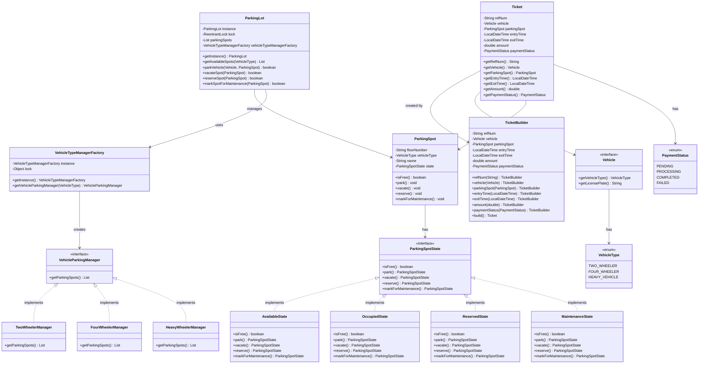

# Parking Lot System

## Overview
A robust parking lot management system that handles different types of vehicles, parking spots, and payment processing. The system is designed with scalability, maintainability, and extensibility in mind.

## System Architecture

### Component-Level Design Pattern Usage


### Class Diagram


## Design Patterns Implementation

### 1. Singleton Pattern
- **Implementation**: `ParkingLot`, `VehicleTypeManagerFactory`, `TicketGenerator`
- **Purpose**: Ensure single instance of critical system components
- **Thread Safety**: Double-checked locking with ReentrantLock
- **Usage**:
  ```java
  // ParkingLot singleton
  private static ParkingLot instance;
  private static final ReentrantLock lock = new ReentrantLock();
  
  public static ParkingLot getInstance() {
      if (instance == null) {
          lock.lock();
          try {
              if (instance == null) {
                  instance = new ParkingLot();
              }
          } finally {
              lock.unlock();
          }
      }
      return instance;
  }
  ```

### 2. State Pattern
- **Implementation**: `ParkingSpot` with `ParkingSpotState` interface
- **Purpose**: Manage parking spot states and their transitions
- **States**: Available, Occupied, Reserved, Maintenance
- **Usage**:
  ```java
  public class ParkingSpot {
      private ParkingSpotState state;
      
      public void park() {
          state = state.park();
      }
      
      public void vacate() {
          state = state.vacate();
      }
  }
  ```

### 3. Factory Pattern
- **Implementation**: `VehicleTypeManagerFactory`
- **Purpose**: Create appropriate vehicle parking managers
- **Usage**:
  ```java
  public VehicleParkingManager getVehicleParkingManager(VehicleType vehicleType) {
      switch (vehicleType) {
          case TWO_WHEELER:
              return new TwoWheelerManager();
          case FOUR_WHEELER:
              return new FourWheelerManager();
          case HEAVY_VEHICLE:
              return new HeavyWheelerManager();
      }
  }
  ```

### 4. Builder Pattern
- **Implementation**: `Ticket.TicketBuilder`
- **Purpose**: Construct complex Ticket objects with validation
- **Usage**:
  ```java
  public Ticket generateTicket(Vehicle vehicle, ParkingSpot parkingSpot) {
      return new Ticket.TicketBuilder()
              .refNum(generateUniqueTicketNum())
              .vehicle(vehicle)
              .parkingSpot(parkingSpot)
              .entryTime(LocalDateTime.now())
              .paymentStatus(PaymentStatus.PENDING)
              .build();
  }
  ```

## SOLID Principles Implementation

### 1. Single Responsibility Principle (SRP)
- **ParkingSpot**: Manages only parking spot state and properties
- **Ticket**: Handles only ticket-related information
- **VehicleParkingManager**: Manages only vehicle-specific parking logic
- **TicketGenerator**: Focuses solely on ticket generation

### 2. Open/Closed Principle (OCP)
- **Vehicle Types**: New vehicle types can be added without modifying existing code
- **Parking States**: New states can be added by implementing ParkingSpotState
- **Payment Methods**: New payment methods can be added without changing existing code
- **Pricing Strategies**: New pricing strategies can be added without modifying existing code

### 3. Liskov Substitution Principle (LSP)
- **Vehicle Implementations**: All vehicle types can be used interchangeably
- **ParkingSpotState**: All state implementations can be used interchangeably
- **VehicleParkingManager**: All manager implementations can be used interchangeably

### 4. Interface Segregation Principle (ISP)
- **Vehicle Interface**: Contains only vehicle-specific methods
- **ParkingSpotState Interface**: Contains only state-related methods
- **VehicleParkingManager Interface**: Contains only parking management methods

### 5. Dependency Inversion Principle (DIP)
- **ParkingLot**: Depends on VehicleParkingManager interface, not concrete implementations
- **ParkingSpot**: Depends on ParkingSpotState interface, not concrete states
- **TicketGenerator**: Depends on Ticket interface, not concrete implementation

## Additional Design Notes

### 1. Thread Safety
- Singleton implementations use double-checked locking
- ReentrantLock for ParkingLot instance
- Synchronized block for VehicleTypeManagerFactory

### 2. Error Handling
- Validation in TicketBuilder
- IllegalStateException for missing required fields
- IllegalArgumentException for unsupported vehicle types

### 3. Extensibility Points
- New vehicle types can be added
- New parking spot states can be added
- New payment methods can be added
- New pricing strategies can be added

### 4. Testing Considerations
- Interfaces allow for easy mocking
- State pattern enables state transition testing
- Builder pattern simplifies test object creation
- Factory pattern allows for test-specific implementations

### 5. Future Enhancements
- Add payment processing system
- Implement pricing strategies
- Add reservation system
- Add user authentication
- Add reporting system
- Add notification system

## Low-Level Design Preparation Notes

1. **Class Design**
   - Clear separation of concerns
   - Proper encapsulation
   - Immutable objects where appropriate
   - Thread-safe implementations

2. **Interface Design**
   - Small, focused interfaces
   - Clear contract definitions
   - Proper abstraction levels

3. **Error Handling**
   - Proper exception hierarchy
   - Meaningful error messages
   - Graceful error recovery

4. **Testing Strategy**
   - Unit test coverage
   - Integration test scenarios
   - Performance test cases
   - Edge case handling

5. **Documentation**
   - Clear class responsibilities
   - Method documentation
   - Design pattern usage
   - Extension points

6. **Code Quality**
   - Consistent naming conventions
   - Proper code organization
   - Clean code principles
   - SOLID principles adherence 